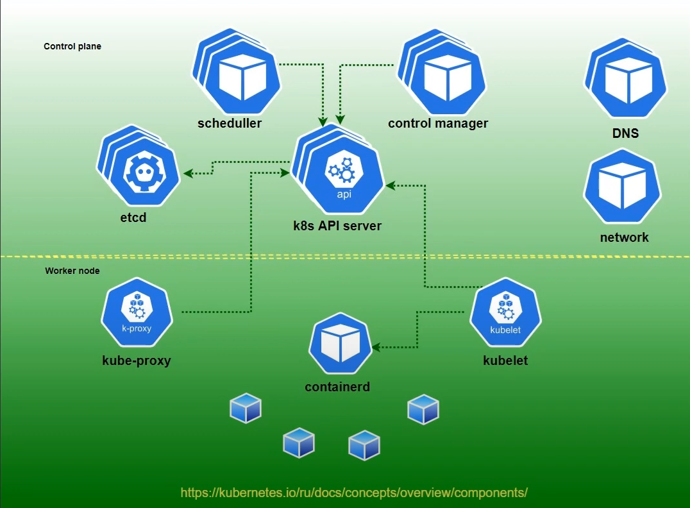
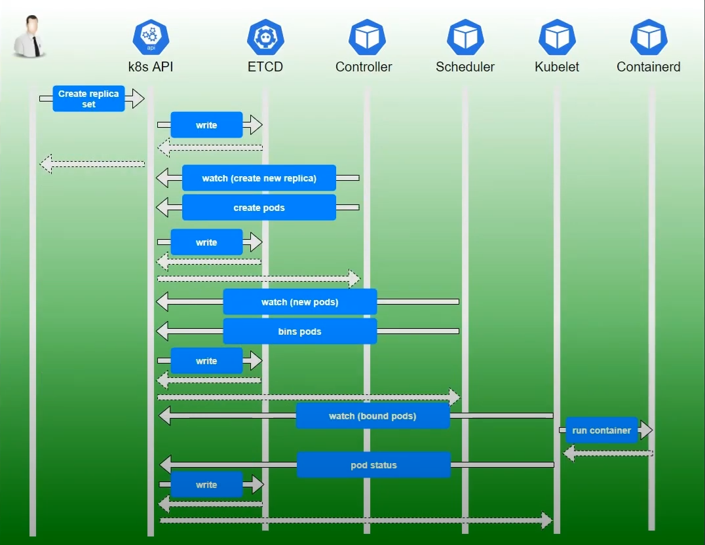

### Компоненты k8s 

**API сервер**: Взаимодействие с кластером происходит через API сервер утилой kubectl.  

**ETCD**: Всё что мы передаем через API сервер, будет сохранено в базе данных ETCD.  

**Control Manager**: Отвечает за то, чтобы всё что вы не положили в ETCD, появилось в кластере.  

**Scheduler**: Отвечает за размещение подов на конкретных нодах кластера.  

**Kubelet**: Шедулер предоставляет информацию о том где разместить под Кублету. Кублет взаимодействует с системой
контейнеризации. Кублет запускает image.  

**Kube-proxy**: Организует работу сервисов.  

Компоненты делятся на два типа Control Plane и Worker Node.

---

### Флоу на примере создания ReplicaSet.  

Пишем файл манифеста и через kubectl передаём в API server, который записывает этот манифест в базу ETCD. Возвращается ответ, что всё окей.  

Все элементы k8s с определённой периодичностью опрашивают API server. Сам API server обращается только к ETCD базе.  

Соответственно Control Manager смотрит(watch) на API server с вопросом, есть ли какие-то изменения(например появилась ReplicaSet) и 
посылает в API server информацию о том, что необходимо создать POD.  

Scheduler опрашивает API server информацию о создании новых POD. Видит информацию о POD ReplicaSet и посылает в API server 
данные, что POD должен быть размещён на конкретной Node кластера.  

Kubelet, работает на каждой ноде, опрашивает API server, находит информацию о том, что на этой NODE надо запустить контейнер и 
передаёт информацию системе контейнеризации, которая в свою очередь, запускает контейнер.

- Control plane.
    - Нечетное количество. Желательно минимум 3 шт.
    - Минимум 2 CPU.
    - Минимум 4GB RAM.

- Worker nodes.
    - Количество машин. Посчитать потребности исходя из:
      - Каждый микросервис должен быть как минимум в двух экземплярах.
      - По возможности микросервисы должны деплоится на разных машинах кластера.
      - Не более ~20-30 микросервисов на ноде.
      - Если необходимо, предусмотреть запас на автоскейлинг приложений.
      - Итоговое значение + минимум 1 нода кластера.
